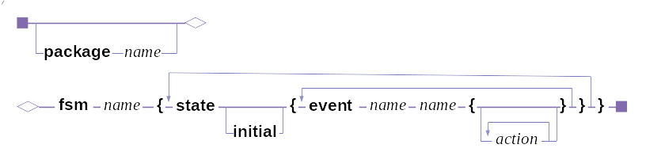

# A State Machine Compiler

A long time ago, I came across Robert Martin's "State Machine Compiler" from his old web site objectmentor.com.  The original SMC was in C++ and I thought it would be nice to have something like that in Java.  Eventually, someone did make a Java port, but didn't upload the source since, he said, the code was not quite in good enough shape to publish.  This was the situation for quite a while.

Many years later as I was looking for a coding exercise topic, I remembered this gap and decided that I should make a java port myself.  Once I had it done, though, I realized that the SMC that I had written was itself a state machine and that it should be possible to write the SMC using the SMC itself. So that's what I did and that's the code that's in the "attic" directory.  It's in the "attic" becuase the code itself is now a bit dated and am planning to update it to modern java coding standards.  I had been again looking for a coding exercise topic (java 9+) and again remembered this bit of code.

There is java code from Mr Martin on [sourceforge](https://sourceforge.net/projects/javasmc) and [github](https://github.com/unclebob/smcjava) but these seem to have come out much later than the original java port mentioned above.  Text of the original article, for the most part, is at [smc.txt](https://github.com/unclebob/smcjava/blob/master/Docs/smc.txt) here on github.

#### ... some time later

Well, it turns out there wasn't that much to do.  Changed some 'Vector's to 'List's, reworked the internal STATE classes a bit and a few other cosmetic changes. To build the smc jar, just checkout the repo, cd into it and run the <code>./build</code> script.  That will bootstrap an smc.jar, generate new <code>Action, Event and FSM</code> classes and rebuild the smc.jar with the newly generated classes.  You can sort of see how to use the fsm from the <code>src/smc.java</code> and <code>smc/smcContext.java</code> files.  Basically, 'smc' drives the generated Action/Event/FSM code which in turn call into the 'smcContext' for any needed external user-supplied functionality.  The simple smc fsm syntax is: 

I'll eventually put up a separate example to make usage clearer, most probably the Turnstile example from the oritinal article.  
